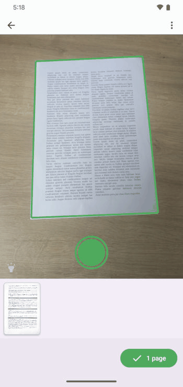
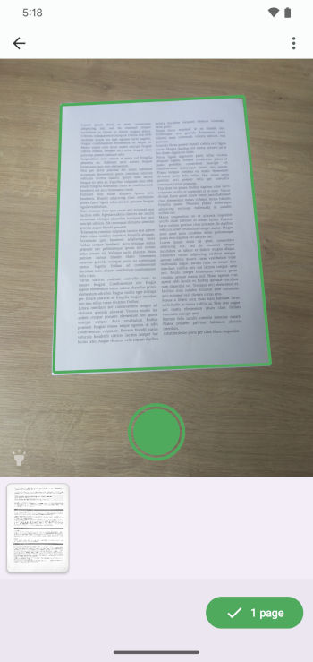
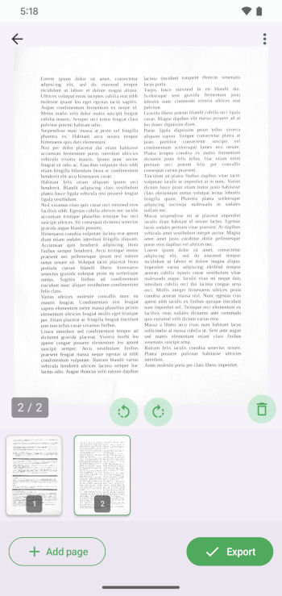
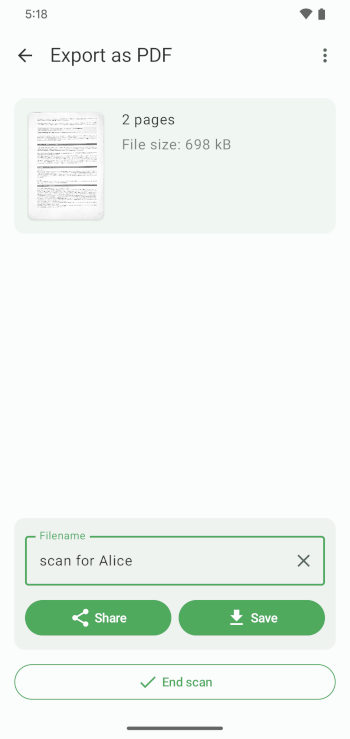

# BharatScan

<p align="center">
  
</p>

<p align="center">
  
</p>

<p align="center">
  
  
  
  
  
  
  
  
  
  <a href="https://github.com/ahansardar/BharatScan/actions/workflows/ci.yml"></a>
</p>

<p align="center">
  <a href="#features">Features</a> | <a href="#feature-highlights">Feature Highlights</a> | <a href="#screenshots">Screenshots</a> | <a href="#quick-start">Quick Start</a> | <a href="#tech-stack">Tech Stack</a> | <a href="#license">License</a>
</p>

<p align="center">
  <b>Scan. Enhance. Export.</b>
</p>

BharatScan is a Made in India Android document scanning app built with Jetpack Compose, CameraX, and on-device ML for segmentation and OCR. This repo includes the Android app plus supporting JVM modules for image processing and evaluation.

## Features
- Camera-based document capture and scanning workflow.
- Automatic document boundary detection and auto-cropping via an on-device segmentation model.
- PDF export with optional OCR text layer (ML Kit Text Recognition).
- Built-in PDF viewer with zoom and search highlights.
- PDF password handling and optional security gate via device biometrics.
- Export formats and quality controls (see settings and export screens in the app).
- External intent support for `org.bharatscan.app.action.SCAN_TO_PDF` and PDF `VIEW/EDIT` intents.

## Feature Highlights
<table>
  <tr>
    <td></td>
    <td>
      <b>Auto Crop + Clean Edges</b><br>
      Segmentation-driven boundary detection for crisp, readable scans.<br><br>
      <b>OCR PDF Export</b><br>
      Create searchable PDFs with an optional text layer powered by ML Kit.<br><br>
      <b>Fast Share and Save</b><br>
      Export in multiple formats with quality controls and watermark options.
    </td>
  </tr>
</table>

## Screenshots
<table>
  <tr>
    <td><b>Scan Flow</b><br></td>
    <td><b>Enhance</b><br></td>
    <td><b>Export</b><br></td>
  </tr>
</table>

## Tech Stack
- Kotlin 2.3.10 and Java 11 bytecode.
- Android Gradle Plugin 8.13.2.
- Jetpack Compose (BOM `2026.03.00`).
- CameraX, ML Kit Text Recognition, PDFBox-Android.
- LiteRT (TFLite runtime) for on-device segmentation.
- OpenCV (JVM bindings) in `imageprocessing`.

## Project Structure
- `app` Android application module (Compose UI, CameraX, PDF, OCR, settings, export).
- `imageprocessing` JVM library with OpenCV-backed image utilities and transforms.
- `evaluation` JVM module for evaluation workflows built on `imageprocessing`.
- `gradle` Version catalog and Gradle plugin configuration.
- `metadata` Play/metadata assets (if used for releases).

## Requirements
- JDK 11.
- Android Studio (recommended) or command-line Gradle.
- Android SDK with API 36 installed.
- Network access during first build to download the segmentation model.

## Quick Start
The project uses the Gradle wrapper.

```bash
# Debug build
./gradlew :app:assembleDebug

# Install to a connected device
./gradlew :app:installDebug
```

Windows PowerShell:

```powershell
.\gradlew.bat :app:assembleDebug
.\gradlew.bat :app:installDebug
```

## Model Download
The segmentation model is downloaded during `preBuild`.

- Task: `downloadTFLiteModel` in `app/download-tflite.gradle.kts`.
- Model name: `fairscan-segmentation-model.tflite`.
- Download location: `app/build/downloads/` and copied into generated assets.

If you are building offline, run once with network access or pre-seed the model file into `app/build/downloads/`.

## Build Configuration
- `minSdk`: 26
- `targetSdk`: 36
- `compileSdk`: 36
- ABI splits are enabled for APKs. Output names follow `BharatScan-<versionName>-<abi>.apk`.

## Signing
Release signing is enabled when these Gradle properties are present:
- `RELEASE_STORE_FILE`
- `RELEASE_STORE_PASSWORD`
- `RELEASE_KEY_ALIAS`
- `RELEASE_KEY_PASSWORD`

Without these, the release build type will still be configured but unsigned.

## Permissions
The app uses:
- `android.permission.CAMERA`
- `android.permission.WRITE_EXTERNAL_STORAGE` (Android 9 and below, for saving files)

## Intents
MainActivity handles:
- Launcher entry point.
- Custom action: `org.bharatscan.app.action.SCAN_TO_PDF`.
- PDF view/edit intents for `application/pdf` with `file` and `content` schemes.

## Testing
Unit and instrumentation tests are configured in the `app` module.

```bash
./gradlew :app:test
./gradlew :app:connectedAndroidTest
```

## Contributing
Issues and PRs are welcome. Please keep changes small and focused, and include test updates where appropriate. See `CONTRIBUTING.md` for details.

## License
This project is licensed under the GNU General Public License, version 3 or later (GPL-3.0-or-later). See `LICENSE_HEADER` and `app/src/main/res/raw/gpl3.txt`.
